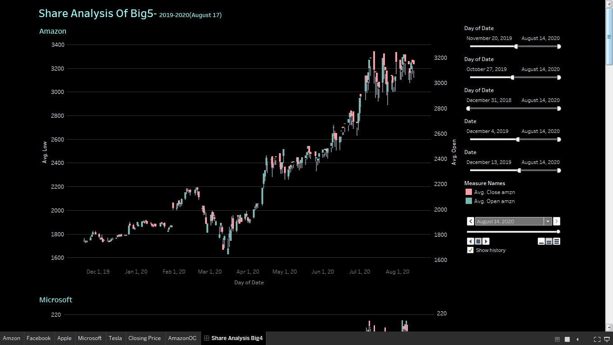
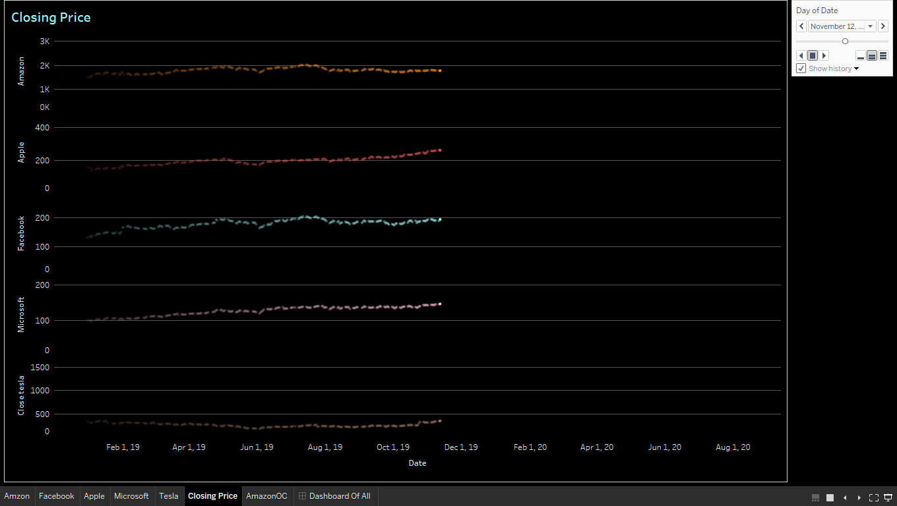

# *Building Candle Stick Charts & Other Analysis Of Big5*





## *What is Candle Stick & Their Usage:*
> A candlestick is a type of price chart used in technical analysis that displays the high, low, open, and closing prices of a security for a specific period. It originated from Japanese rice merchants and traders to track market prices and daily momentum hundreds of years before becoming popularized in the United States. The wide part of the candlestick is called the "real body" and tells investors whether the closing price was higher or lower than the opening price (black/red if the stock closed lower, white/green if the stock closed higher).
Key Takeaways
```xml
Candlestick charts display the high, low, open, and closing prices of a security for a specific period.             Candlesticks originated from Japanese rice merchants and traders to track market prices and daily momentum hundreds of years before becoming popularized in the United States.
Candlesticks can be used by traders looking for chart patterns.
```

>Candlestick Charts:


###### [Source](https://www.investopedia.com/terms/c/candlestick.asp)
```xml
The candlestick's shadows show the day's high and low and how they compare to the open and close. A candlestick's shape varies based on the relationship between the day's high, low, opening and closing prices.

Candlesticks reflect the impact of investor sentiment on security prices and are used by 
technical analysts to determine when to enter and exit trades. Candlestick charting is 
based on a technique developed in Japan in the 1700s for tracking the price of rice. 
Candlesticks are a suitable technique for trading any liquid financial asset such as stocks, 
foreign exchange and futures.

Long white/green candlesticks indicate there is strong buying pressure; this typically 
indicates price is bullish. However, they should be looked at in the context of the market 
structure as opposed to individually. For example, a long white candle is likely to have 
more significance if it forms at a major price support level. Long black/red candlesticks 
indicate there is significant selling pressure. This suggests the price is bearish. A common  
bullish candlestick reversal pattern, referred to as a hammer, forms when price moves 
substantially lower after the open, then rallies to close near the high. The equivalent 
bearish candlestick is known as a hanging man. These candlesticks have a similar appearance 
to a square lollipop, and are often used by traders attempting to pick a top or bottom in  
a market.

Traders can use candlestick signals to analyze any and all periods of trading including 
daily or hourly cycles—even for minute-long cycles of the trading day.
```

## Get Touch With Me:
Connect- [Linkedin](https://linkedin.com/in/rakibhhridoy)
Website- [RakibHHridoy](https://rakibhhridoy.github.io)
